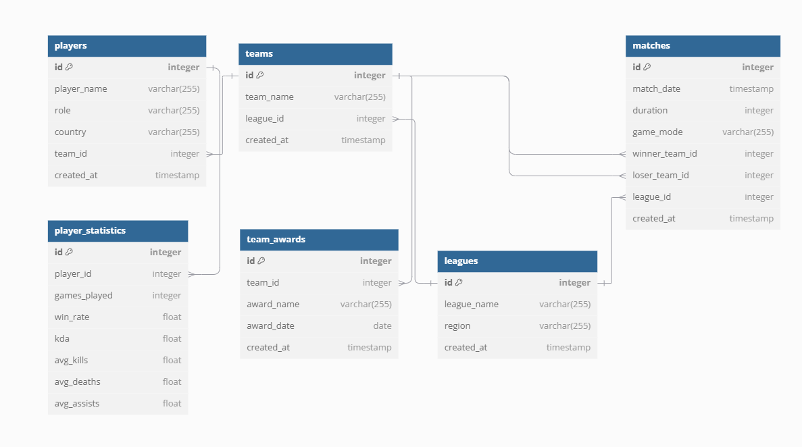

# 💾 Esportová databáze hráčů  

## 📖 Popis  
Tento projekt obsahuje **SQL databázi pro správu hráčů, týmů a statistik v esportu**.  
Databáze uchovává informace o hráčích, týmech, ligách, zápasech a statistikách.  

✅ **Správa hráčů a týmů** – ukládání informací o hráčích, jejich rolích a příslušnosti k týmům  
✅ **Sledování zápasů** – ukládání výsledků zápasů v různých ligách  
✅ **Analýza výkonu hráčů** – statistiky jako KDA, win rate a průměrné hodnoty zabití/asistencí  
✅ **Historie ocenění týmů** – ukládání získaných ocenění týmů  

## 🛠 Struktura databáze  

- **`players`** – uchovává informace o hráčích (jméno, role, tým, země)  
- **`teams`** – obsahuje informace o týmech a jejich příslušnosti k ligám  
- **`leagues`** – databáze lig s názvem a regionem  
- **`matches`** – ukládá výsledky zápasů včetně délky, režimu hry a vítězného týmu  
- **`player_statistics`** – uchovává statistiky hráčů jako win rate nebo KDA  
- **`team_awards`** – sleduje ocenění týmů v různých obdobích

 
